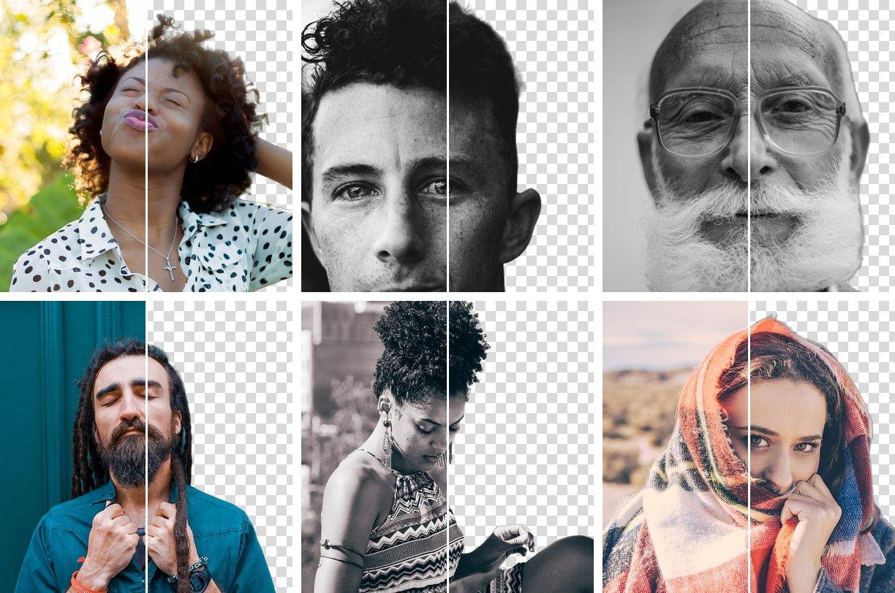

# bg-remove

Self-hosted background removal API. A drop-in replacement for PhotoRoom's `/v1/segment`:
same request (multipart `image_file`, header `x-api-key`), same response (RGBA PNG).
Runs **BiRefNet-general-lite** (MIT) on a **Modal L4 GPU**, for ~US$15 a month at 5k photos.



<sub>Each tile: original on the left, API output on the right (transparency as a checkerboard).
Photos, all [CC0](https://creativecommons.org/publicdomain/zero/1.0/) via Wikimedia Commons:
[William Stitt](https://commons.wikimedia.org/wiki/File:Girl_with_Afro_2.jpg),
[Jeremy Bishop](https://commons.wikimedia.org/wiki/File:Curly_hair_and_freckles_man_(Unsplash).jpg),
[Angelina Litvin](https://commons.wikimedia.org/wiki/File:Man_with_a_white_beard_and_glasses,_by_Angelina_Litvin,_2015-10-05_(Unsplash).jpg),
[Toa Heftiba](https://commons.wikimedia.org/wiki/File:Closed_Eyes_(Unsplash).jpg),
[Raquel Santana](https://commons.wikimedia.org/wiki/File:First_Shoot_(Unsplash).jpg),
[Avi Richards](https://commons.wikimedia.org/wiki/File:Desert_Princess_(Unsplash).jpg).</sub>

## Results

Measured on 100 real portrait photos from a production ID-badge flow, against PhotoRoom's
output as ground truth (IoU = mask overlap, 1.0 = identical).

| | PhotoRoom | bg-remove (BiRefNet-lite, L4) |
|---|---|---|
| Mask agreement (IoU, mean / min) | 1.0 / 1.0 | **0.984 / 0.904** |
| Cases visibly worse | — | 0 / 100 |
| Inference p50 / p99 | — | **0.77 s / 1.48 s** |
| Server time p50 / p99 (upload + infer + encode) | ~2 s | **1.2 s / 1.8 s** |
| Cold start (container restored from snapshot) | — | 7 to 16 s to first byte |
| Cost at 5k photos/month | ~US$100 | **~US$15** |
| License | commercial API | MIT (model and code) |

Other models, CPU numbers and preprocessing ablations are in [docs/benchmark.md](docs/benchmark.md);
what went wrong along the way is in [docs/lessons.md](docs/lessons.md).

## Quick start

```bash
uv sync --extra cpu --extra dev
cp .env.example .env                          # set BG_REMOVE_API_KEY
uv run uvicorn --factory bg_remove.api:default_app --port 8000
curl -X POST localhost:8000/v1/segment -H "x-api-key: $KEY" \
  -F image_file=@docs/assets/example-input.jpg -o out.png
```

Locally it runs on CPU (5 to 10 s per photo). To deploy on a Modal GPU, with an optional
custom domain through Cloudflare, follow **[DEPLOY.md](DEPLOY.md)**.

## API

| Method | Path | Auth | Body | Response |
|---|---|---|---|---|
| POST | `/v1/segment` | `x-api-key` | multipart `image_file` (jpeg/png/webp, ≤15 MB) | `image/png` RGBA, same size as input. Headers `X-Infer-S`, `X-Model` |
| GET | `/health` | none | — | `{ok, version, model, device, load_s}` |

Errors: 401 bad key, 400 empty file, 413 too large, 422 not an image.

Coming from PhotoRoom, swap two values:

```python
response = requests.post(
    "https://<workspace>--bg-remove.modal.run/v1/segment",  # was https://sdk.photoroom.com/v1/segment
    headers={"x-api-key": API_KEY},
    files={"image_file": ("photo.jpg", image_bytes)},
    timeout=180,  # a cold container can take up to ~150 s; see DEPLOY.md
)
response.raise_for_status()
png = response.content  # RGBA PNG
```

## License

[MIT](LICENSE). BiRefNet weights are MIT as well; do not switch to `bria-rmbg` (RMBG-2.0)
for commercial use, it is CC BY-NC. Example photos are CC0.
